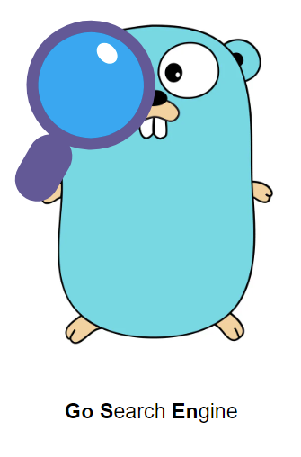

<p align="center">
  
</p>

### Local Search Engine in Golang

Inspired by [Local Search Engine in Rust](https://github.com/tsoding/seroost) from [@tsoding](https://github.com/tsoding) made a similar project in [Golang](https://go.dev/).

### Getting Started

```console
go build -tags "sqlite_math_functions" -o <PROGRAM> .
```

### Usage
```console
Usage: ./C:\Users\ujjaw\Probe\gosen\gosen.exe <SUBCOMMAND> <FLAGS>
    SUBCOMMANDS:
        - build: for building index db on documents present in a given directory
        - query: for finding closest matching document for a given query using tf-idf
        - serve: for serving index db on web
        - help: see help

Usage of build:
  -db string
        Path of db to store the index. Supported formats: [.db, .json] (default "index.db")
  -dir string
        Directory containing the files

Usage of query:
  -db string
        Path of db to store the index. Supported formats: [.db, .json] (default "index.db")
  -query string
        Search query
  -topN uint
        Top N results to show (default 10)

Usage of serve:
  -addr string
        Address to serve the server on (default "127.0.0.1:6969")
  -db string
        Path of db to store the index. Supported formats: [.db, .json] (default "index.db")
```

### References

1. Stolen [saxlike](./saxlike/) from [@kokardy/saxlike](https://github.com/kokardy/saxlike/tree/master)

2. [@tsoding's](https://github.com/tsoding) Playlist ["Search Engine in Rust"](https://youtube.com/playlist?list=PLpM-Dvs8t0VZXC-91PpIp-eAt0WF5SKEv&si=M0LhV-bsL8jHrE5t)

3. [Stopwords](./stopwords.go) taken from: https://www.ranks.nl/stopwords (Long Stopword List)

### Copyrights

Licensed under [@MIT](./LICENSE)
